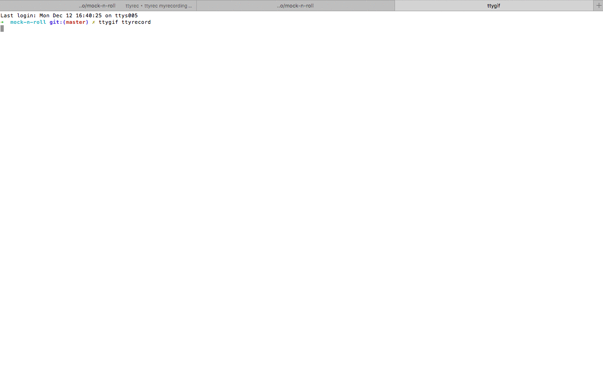

# mock-n-roll
configurable rest service system mock

## Motivation
* you don't need mock-n-roll for mocking service layers in your unit tests, use [Sinion](http://sinonjs.org/)
* you don't need mock-n-roll for mocking http requests in your integration tests, use network interceptors - [nock](https://github.com/node-nock/nock) is cool
* when doing blackbox testing of your client side code, you may want to use mock-n-roll.

## Demo


### curl example
#### before / setUp
* you could specify any repsonse body in the post body
* you cold specify any service call as path parameter, here environment, /mock/configure/**environment**/200
* you cold specify any response http code as path parameter, here 200, /mock/configure/environment/**200**

``` bash
echo '{
    "location": {"longitude": 89.582, "latitude": 99.1351},
    "zipId": "19900135",
    "ssd": {},
    "connection": {"wifiStatus": "OK", "radioStatus": "HIGH"}
      }
' | curl -X POST -d @- http://localhost:3081/mock/configure/environment/200 --header "Content-Type:application/json"
```

#### test / action that triggers the call
``` bash
curl http://localhost:3081/api/v1/environment
```

#### after / tearDown
``` bash
curl -X DELETE http://localhost:3081/mock/configure
```

### code example
#### before
todo mocha before
#### test
#### after

### mock-n-roll.config.js
```javascript
module.exports = {
    vHost: 'your.funny.domain.dev',
    baseUrl: '/api/v1',
    port: 1234,
    mockedMethods = [
        'get',
        'post',
        'put',
        'patch',
        'delete',
        // 'head'
    ]
}
```

### TODO
- [ ] get rid of connect-*
- [x] cross-env or cli or node standard
- [ ] author
- [ ] SwaggerDoc
- [x] licence
- [x] mxd-eslint

### upcoming features
- [ ] default overrule pathes (feature)
- [ ] proxy recording mode
- [ ] [ngrok](https://ngrok.com/)

### used/liked
                *  express
                *  (https://github.com/icholy/ttygif)
                *  https://github.com/swagger-api/swagger-js

``` bash
 $ git commit -a  --author="bs <email>" -m "readme"
```

License
-------

Copyright 2016

Licensed under the Apache License, Version 2.0 (the "License");
you may not use this file except in compliance with the License.
You may obtain a copy of the License at
[apache.org/licenses/LICENSE-2.0](http://www.apache.org/licenses/LICENSE-2.0)

Unless required by applicable law or agreed to in writing, software
distributed under the License is distributed on an "AS IS" BASIS,
WITHOUT WARRANTIES OR CONDITIONS OF ANY KIND, either express or implied.
See the License for the specific language governing permissions and
limitations under the License.
